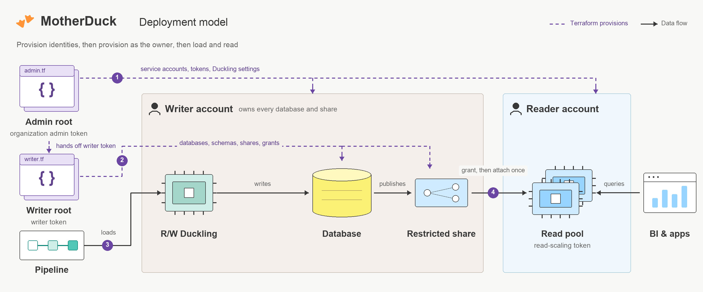

# MotherDuck Terraform Provider

Build data warehouses and customer-facing analytics on MotherDuck with
infrastructure you can review, reproduce, and manage in Terraform.

[Provider documentation](docs/index.md) ·
[Terraform Registry](https://registry.terraform.io/providers/motherduckdb/motherduck/latest/docs) ·
[Examples](examples/warehouses/README.md) ·
[Releases](https://github.com/motherduckdb/terraform-provider-motherduck/releases)



## Start with a workload

| Build | Start here |
| --- | --- |
| Your first orders warehouse | [Create, load, and query daily revenue](docs/guides/getting-started.md) |
| A warehouse with raw, transform, and marts layers | [Build a layered warehouse](docs/guides/warehouse-examples.md) |
| Independent dev and production environments | [Separate identities, credentials, and state](docs/guides/environments.md) |
| Usage dashboards for SaaS customers | [Provision tenant databases and readers](docs/guides/customer-facing-analytics.md) |
| Python pipelines and interactive dashboards | [Combine Terraform with Blueprints](docs/guides/blueprints-deployment.md) |

New to MotherDuck's ownership and compute model? Start with
[choosing a deployment architecture](docs/guides/deployment-model.md).

## Install and create a database

Supply a read-write token as `MOTHERDUCK_TOKEN` through your secret manager or
environment, then save this as `main.tf`:

```hcl
terraform {
  required_version = ">= 1.5.0"
  required_providers {
    motherduck = {
      source  = "motherduckdb/motherduck"
      version = "~> 0.2.3"
    }
  }
}

provider "motherduck" {}

resource "motherduck_database" "analytics" {
  name                    = "analytics"
  snapshot_retention_days = 7
}
```

```shell
terraform init
terraform plan -out=tfplan
terraform apply tfplan
```

Terraform installs the provider from the Registry and verifies the publisher
signature. Commit `.terraform.lock.hcl` with your configuration. For environments
without Registry access, use the [signed release installation guide](docs/guides/github-installation.md).

The database belongs to the account behind the token. For automation, use a
dedicated writer service account. Creating an account and provisioning its data
are [separate deployment stages](docs/guides/authentication.md).

## What belongs in Terraform

| Area | Managed resources |
| --- | --- |
| Warehouse structure | Databases, schemas, tables, views |
| Identity and compute | Service accounts, access tokens, Duckling configuration |
| Data access | Shares, share grants, roles, role grants |
| Storage and recovery | Persistent secrets, named snapshots |
| Optional application definitions | Flights, experimental Dives and Guides |

Use an ingestion or transformation pipeline to load and refresh data. Use
[MotherDuck Blueprints](https://github.com/motherduckdb/motherduck-blueprints) for
application packages when Python, dashboard code, and Guide content should have
previews and release promotion. Assign each object to one deployment owner.
Flight-run resources are deprecated. See [resource scope](docs/guides/resource-scope.md).

## Operate the deployment

- [Authentication](docs/guides/authentication.md): SQL versus organization admin
  credentials, writer ownership, and token rotation.
- [Sharing and read scaling](docs/guides/sharing-and-read-scaling.md): curated
  access, reader initialization, and freshness.
- [State and imports](docs/guides/state-and-lifecycle.md): adopt existing
  resources, understand replacement, and protect data.
- [Terraform best practices](docs/guides/terraform-best-practices.md): modules,
  dependency ordering, and production configuration.

Table column changes replace tables. Protect important data before adopting
these examples. Token and secret values can be stored in state even when marked
sensitive, so use an encrypted backend with restricted access and locking.

Terraform 1.5+ is supported, with Linux and macOS packages for amd64 and arm64.
Ephemeral resources require Terraform 1.10+. See the
[tested Terraform and OpenTofu matrix](docs/guides/ci-and-release.md).

## Contribute

Read [AGENTS.md](AGENTS.md), [CONTRIBUTING.md](CONTRIBUTING.md), and the
[CI and release guide](docs/guides/ci-and-release.md) before changing provider
behavior or packaging. Keep documentation sources in `templates/` and runnable
configurations in `examples/`, then run `make docs`.

Use [local development](docs/guides/local-development.md) for a source build and
[testing](docs/guides/testing.md) for validation commands. Run
`make pre-push-check` before opening or updating a PR, and `make release-check`
for packaging changes. Internal Go packages are implementation details.

Report provider issues with minimal configuration and redacted diagnostics in
[GitHub Issues](https://github.com/motherduckdb/terraform-provider-motherduck/issues).
Report vulnerabilities privately through [SECURITY.md](SECURITY.md).
Licensed under [Apache 2.0](LICENSE).
