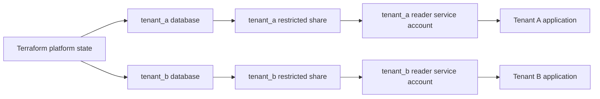

# Blueprint: Hypertenancy

This blueprint gives every tenant an isolated MotherDuck database, reader service account, read token, and restricted share. It is a good fit when tenant data needs strong operational separation and each tenant can be managed independently.

## Architecture



## Terraform Shape

Use `for_each` over a tenant map. Each tenant gets:

- `motherduck_database`
- `motherduck_schema`
- `motherduck_service_account`
- `motherduck_access_token`
- `motherduck_share`
- `motherduck_share_grant`

The example implementation is in `examples/blueprints/hypertenancy`.

This blueprint includes REST-backed service-account and access-token resources. It requires `MOTHERDUCK_TOKEN` for SQL resources and an organization-admin `MOTHERDUCK_ADMIN_TOKEN` for reader service accounts, token creation, and share grants.

The identity behind `MOTHERDUCK_TOKEN` owns every tenant database and share this blueprint creates, which makes it the only identity that can write tenant data and the only one allowed to `GRANT READ ON SHARE` to the readers. Run the module with a dedicated writer service account token (see the writer-bootstrap blueprint) rather than a personal token, so ownership does not depend on an individual's account.

Generated names are intentionally conservative: `database_prefix`, `share_prefix`, and `reader_prefix` must start with an ASCII letter and contain only ASCII letters, digits, and underscores. Tenant keys and optional slugs are normalized into lowercase alphanumeric/underscore suffixes so generated names stay importable and shell-friendly.

## Operating Model

Use this model when:

- tenant data must be restorable, shareable, or dropped independently;
- tenant databases have different lifecycle or retention requirements;
- tenant readers should not need credentials for a shared application database.

Tradeoffs:

- more MotherDuck objects to manage;
- more Terraform state entries;
- tenant migrations must loop over many databases.

## State Guidance

Keep platform administration state separate from tenant data state if different teams own those workflows. Store generated reader tokens in a secret manager immediately and avoid broad access to Terraform state.

## Token Lifecycle And Offboarding

Generated reader tokens expire after `reader_token_ttl_seconds` (30 days by default) and Terraform does not rotate them automatically. Plan a rotation workflow, for example `terraform apply -replace='module.hypertenancy.motherduck_access_token.reader["acme"]'`, before the TTL elapses.

Removing a tenant from the `tenants` map destroys that tenant's database and all data inside it on the next apply. Snapshot or export tenant data first and treat tenant removal as deliberate offboarding.

## Example

Key each tenant by a stable internal tenant id, not by an email or company name; renaming a tenant key replaces every resource for that tenant. Pin the module source to a release tag when consuming this blueprint from another repository.

```hcl
module "hypertenancy" {
  source = "github.com/motherduckdb/terraform-provider-motherduck//examples/blueprints/hypertenancy?ref=v0.1.1"

  tenants = {
    acme = {
      display_name = "Acme"
    }
    globex = {
      display_name = "Globex"
    }
  }
}

output "tenants" {
  value = module.hypertenancy.tenants
}
```
