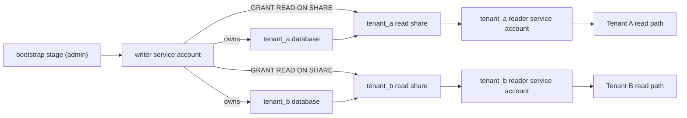

# Blueprint: Read Hypertenancy With Centralized Writes

This blueprint centralizes writes through one writer identity while isolating reads by tenant database and restricted shares. The writer service account owns every tenant database and share; reader identities only consume their tenant share.

## Architecture



## Grant Semantics

Two MotherDuck rules shape this blueprint. A database is writable only by the identity that owns it, and access is granted through shares: `GRANT READ ON SHARE <share> TO <username>` can be run only by the owner of the share. There is no database-level grant and no write grant.

So the writer cannot be an identity Terraform merely creates on the side. The tenant data plane must be applied *as* the writer, making the writer the owner of every tenant database (so the pipeline can write) and every share (so the reader grants are permitted).

## Terraform Shape

Deploy in two stages, each with its own state:

1. **Bootstrap** (`examples/blueprints/writer-bootstrap`): an organization admin applies this with `MOTHERDUCK_ADMIN_TOKEN` to create the writer service account and read-write token. The token goes into a secret manager.
2. **Data plane** (`examples/blueprints/read-hypertenancy`): applied with `MOTHERDUCK_TOKEN` set to the writer token from stage one, plus `MOTHERDUCK_ADMIN_TOKEN` for REST-backed reader service accounts and tokens. Use `for_each` for tenant databases, shares, and reader identities.

The data-plane module accepts an optional `expected_writer_username` guard that fails the plan when the SQL session identity does not match the writer, so tenant databases are never accidentally created under a personal or CI identity.

Generated names are intentionally conservative: `database_prefix`, `share_prefix`, and `reader_prefix` must start with an ASCII letter and contain only ASCII letters, digits, and underscores. Tenant keys and optional slugs are normalized into lowercase alphanumeric/underscore suffixes so generated names stay importable and shell-friendly, and normalized slugs must stay unique across tenants.

## Operating Model

Use this model when:

- writes should be serialized through one controlled identity;
- read workloads should be isolated by tenant;
- tenants need separate share grants and reader credentials;
- data pipelines need a predictable list of tenant databases to update.

Tradeoffs:

- writer credentials have broad write access and need stricter handling;
- Terraform for the data plane runs as the writer, so its credential management is coupled to the pipeline identity;
- application teams should not use writer credentials for reads.

## Write Path

The writer token belongs in the ingestion or modeling runtime secret manager and in the data-plane Terraform runtime. Terraform creates tenant databases as the writer; the runtime job performs actual data writes with the same identity.

## Read Path

Each tenant receives a reader service account and token. The token should be distributed only to that tenant's serving layer. The tenant application reads through the restricted share instead of connecting as the writer.

## Token Lifecycle And Offboarding

Generated writer and reader tokens expire after their configured TTLs (30 days by default) and Terraform does not rotate them automatically. Plan a rotation workflow, for example `terraform apply -replace='module.read_hypertenancy.motherduck_access_token.reader["acme"]'`, before the TTL elapses. Rotating the writer token also means updating the data-plane Terraform credentials.

Removing a tenant from the `tenants` map destroys that tenant's database and all data inside it on the next apply. Snapshot or export tenant data first and treat tenant removal as deliberate offboarding.

## Example

Stage one creates the writer (see the writer-bootstrap blueprint), and its token becomes `MOTHERDUCK_TOKEN` for stage two:

```hcl
module "writer_bootstrap" {
  source = "github.com/motherduckdb/terraform-provider-motherduck//examples/blueprints/writer-bootstrap?ref=v0.1.1"

  writer_username = "svc_writer_prod"
}
```

Stage two, in a separate root module and state. Key each tenant by a stable internal tenant id, not by an email or company name; renaming a tenant key replaces every resource for that tenant. Pin the module source to a release tag when consuming this blueprint from another repository.

```hcl
module "read_hypertenancy" {
  source = "github.com/motherduckdb/terraform-provider-motherduck//examples/blueprints/read-hypertenancy?ref=v0.1.1"

  expected_writer_username = "svc_writer_prod"

  tenants = {
    acme = {
      display_name = "Acme"
    }
    globex = {
      display_name = "Globex"
    }
  }
}

output "tenants" {
  value = module.read_hypertenancy.tenants
}
```
